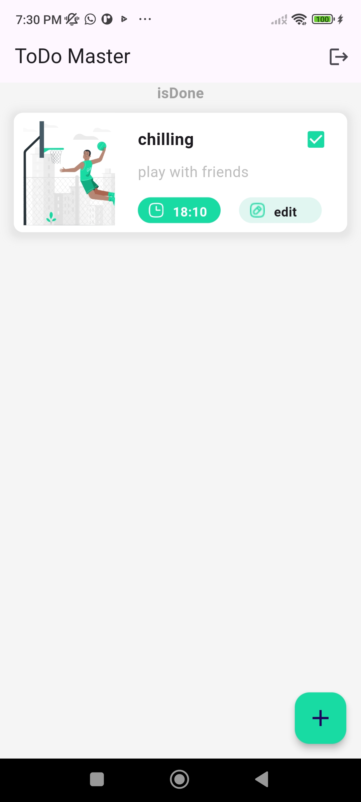
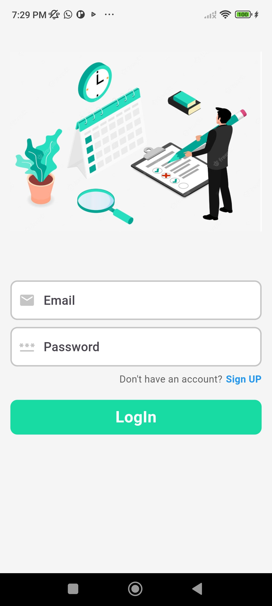
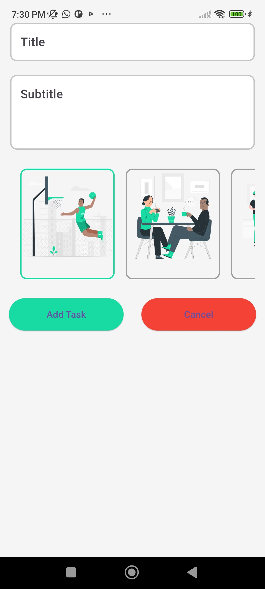

# todo_master_firebase_auth

A new Flutter project.

## Getting Started
Features 
User authentication (sign up, sign in, and sign out) 
Create, read, update, and delete tasks 
Persistent data storage using Firebase Firestore 
Intuitive and user-friendly interface 
Responsive design for various screen sizes 
Technologies Used 
Flutter: A UI toolkit for building natively compiled applications for mobile, web, and desktop from a single codebase. 
Firebase: A platform developed by Google for creating mobile and web applications. It provides services such as authentication, cloud storage, and real-time databases. 

This project is a starting point for a Flutter application. 

A few resources to get you started if this is your first Flutter project: 

- [Lab: Write your first Flutter app](https://docs.flutter.dev/get-started/codelab)
- [Cookbook: Useful Flutter samples](https://docs.flutter.dev/cookbook)

For help getting started with Flutter development, view the
[online documentation](https://docs.flutter.dev/), which offers tutorials,
samples, guidance on mobile development, and a full API reference.
